# Deepin Image Viewer|../common/deepin-image-viewer.svg|

## Overview|../common/icon_overview.svg|

Deepin Image Viewer is an image viewer integrated in deepin. It is fashion and elegant in interface, fast and effeicient for your daily management of images.

## Guide|../common/icon_guide.svg|

User can run, close and create shortcut for Deepin Image Viewer by the following ways.

### Run Deepin Image Viewer

1. Click on  or move the mouse pointer to the upper left corner of the screen to enter Launcher interface.
2. Locate  by scrolling mouse wheel or searching by "deepin image viewer" in Launcher interface.
3. Right click on , user can
 - Click on **Send to desktop** to create a desktop shortcut.
 - Click on **Send to dock** to fix the application on dock.
 - Click on **Add to startup** to add the application to startup, it will automatically run when the system starts up.

> : In Control Center, user can set Deepin Image Viewer as the default image viewer. Specific operations refer to [Default Application Settings](dman:///dde-control-center#Default Application Settings).

### Close Deepin Image Viewer

1. In Deepin Image Viewer interface, click on  to exit Deepin Image Viewer.
2. Right click on  on dock, select **Close all** to exit Deepin Image Viewer.
3. Click on  and select **Exit** to exit Deepin Image Viewer.

## View Image|../common/icon_pictureview.svg|

Deepin Image Viewer is featured with image information viewing, image rotation, slide show, image viewing in timeline and album, and so on. Right click on an image, select ** Open with** > ** Deepin Image Viewer**. If Deepin Image Viewer has been set as the default application for image viewing, user can double-click to open an image with it.

### Image Viewing Interface

<table class="block1">
    <caption></caption>
    <tbody>
        <tr>
            <td></td>
            <td>Image management</td>
            <td>Enter image management interface of Deepin Image Viewer .</td>
        </tr>
        <tr>
            <td></td>
            <td>1:1 Size</td>
            <td>The image will show in 1:1 size without changing the size of the window. If the image exceeds the window, a navigation window will appear at the lower right corner, which helps user to fast locate image areas.</td>
        </tr>
		<tr>
            <td></td>
            <td>Fit to window</td>
            <td>The image will resize to adapt to the current window.</td>
        </tr>
	    <tr>
            <td></td>
            <td>Rotate clockwise</td>
            <td>Rotate the image 90 degrees clockwise.</td>
        </tr>
	    <tr>
            <td></td>
            <td>Rotate couterclockwise</td>
            <td>Rotate the image 90 degrees couterclockwise.</td>
        </tr>
	    <tr>
            <td></td>
            <td>Throw to Trash</td>
            <td>Throw the current image to Trash.</td>
        </tr>
        <tr>
            <td></td>
            <td>Previous</td>
            <td>Switch to the previous image.</td>
        </tr>
        <tr>
            <td></td>
            <td>Next</td>
            <td>Switch to the next image.</td>
        </tr>
    </tbody>
</table>

> : In 1:1 size mode, user can click on  at the upper left corner of navigation window to close it, then it won't automatically show next time. User can select to disable/enable the navigation window in the context menu.

> : By clicking,  and  will switch to each other.

### Start Slide Show

User can start a slide show of all the images in the folder.

1. Open an image in a folder with Deepin Image Viewer.
2. Right click on the image in Deepin Image Viewer interface and select ** Start slide show**.
3. Deepin Image Viewer will enter fullscreen mode and start slide show.
4. To exit slide show, right click on the slide show and select ** Stop slide show**.

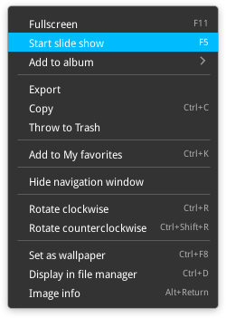

### Delete Image

User can delete images from Deepin Image Viewer.

1. Right click on the image to delete.
2. Select ** Throw to Trash** to delete the image.

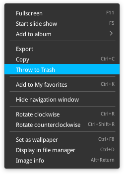

>: The deleted image will also be deleted from disk.

### Rotate Image

User can rotate the image in image viewing interface.
1. Right click on the image in Deepin Image Viewer interface and select ** Rotate clockwise** or ** Rotate counterclockwise**.
2. The image will rotate clockwise or counterclockwise for 90 degrees.

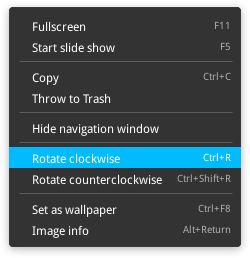

### Set Image as Wallpaper

User can set an image as the desktop wallpaper. Right click on the image in Deepin Image Viewer interface and select **Set as wallpaper**.

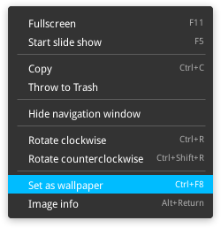

### View Image Information

User can view the detailed information of the image.
1. Right click on the image in Deepin Image Viewer interface and select ** Image info**
2. An information window will popup at the left side of Deepin Image Viewer interface.

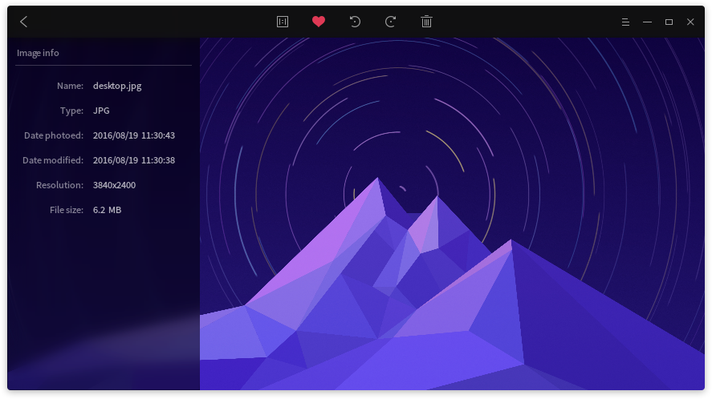

## Image Management|../common/icon_picturemanagement.svg|

In image management interface, user can make changes to timeline and albums, and use search and filter to find the target image. By clicking on  and  to switch between Timeline and Album.

### Timeline

Click on  in Deepin Image Viewer interface to enter Timeline interface.
The images in Timeline are ranked and grouped according to the date photoed/created. The same date, the same group. From the top to the bottom are the latest to the earliest.

#### Image Zooming

The thumbnails of images in Timeline can be zoomed.
1. At the lower-right corner of Deepin Image Viewer interface, click on the slider in the sliding bar.
2. Drag the slider left/right to zoom out/zoom in.

#### Import Image

User can import images to Deepin Image Viewer to better manage images.
1. In Deepin Image Viewer interface, Click on  and select ** Import**, or click on the ** + ** at the lower left corner.
2. Select the folder storing the images.
3. Click on ** Open** to import.

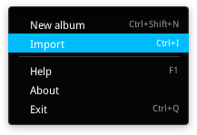

> : User can drag and drop images from file manager to Timeline to import.

### Export Image

User can export images from Deepin Image Viewer.

1. Right click on the image or the album in Deepin Image Viewer interface and select **Export**.
2. Select a directory to export.
3. Input a file name for the image.
4. Select a format for the image and click on **Save** to finish exporting.

** Export image**

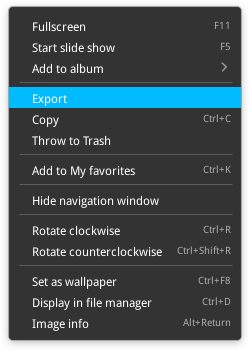

** Export album**

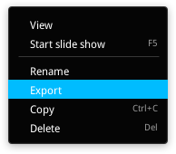

> ：Deepin Image Viewer supports exporting image to various of formats. But it does not support renaming and format conversion while exporting images in batches from ** Timeline** or exporting an ** Album**.

### Display in File Manager

User can locate the directory where the image is stored.
1. Right click on the image in Deepin Image Viewer interface and select ** Display in file manager**.
2. The folder where the image is stored will popup.

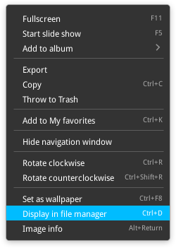

#### Add Image to My Favorites

User can add favorite images to My favorites.
1. In Timeline of Deepin Image Viewer interface, open an image.
2. Right click on the image and select ** Add to My favorites**, or click on  to add the image to My favorites.
3. Right click on the image and select ** Remove from album**, or click on  to remove the image from My favorites.

### Album

Click on  in Deepin Image Viewer interface to enter Album interface.
User can view all the albums in Album interface. It will display album thumbnails, names and the date range of the images in albums.

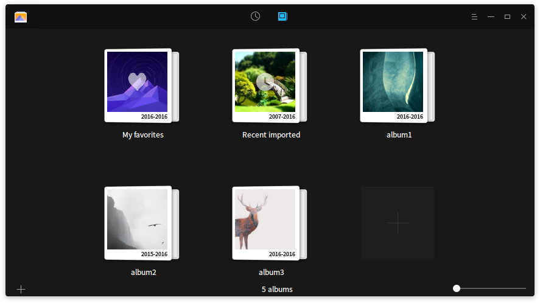

> : There are two default albums in Deepin Image Viewer, respectively ** My favorites** and ** Recent imported**, where user's favorite images and recent imported images can be found. These two albums can not be deleted or renamed.

#### Album Zooming

The thumbnail images of albums can be zoomed.
1. At the lower-right corner of Deepin Image Viewer interface, click on the slider in the sliding bar.
2. Drag the slider left/right to zoom out/zoom in.

#### New Album

User can create new albums to categorize images.
1. In Album interface, click on  and select **New album **.
2. Input a name for the new album, then press  or click on blank area.

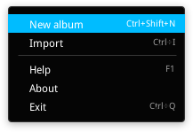

> : User can click on **+ ** to create a new album.

#### Add Image to Album

1. In Album interface, click the icon of an album to enter it.
2. Click on ** Image** in the middle, or **+ ** at the lower left corner.
3. Select the direcotry storing the images to import.
4. Click on ** Open** to import the image to album.

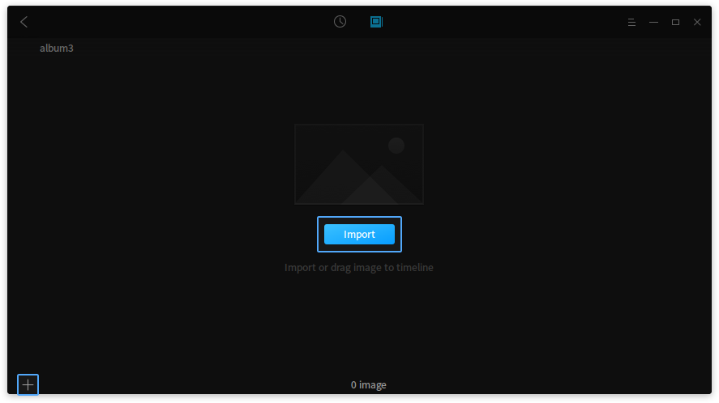

>: Open an image in timeline, and right click on the image, select ** Add to album** then select an album to add the image to the album.

#### Remove Image from Album

In an album, right click on the image and select ** Remove from album** to remove the image from the album.

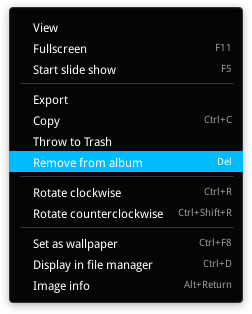

>: To delete an album, right click on the album icon and select ** Delete**, the images in the album will remain in Timeline and the disk.

#### Copy Album

In Album interface, right click on the album icon and select ** Copy** to copy all the images in the album.

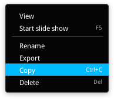

#### Rename Album

1. In Album interface, right click on the album and select ** Rename**.
2. Input a name and press  or click on blank area.

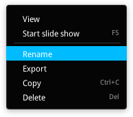

## Settings|../common/icon_optionsetting.svg|

In Deepin Image Viewer interface, click on  to enter ** Settings**.

### Help

In ** Settings**, select ** Help** to view the manual for Deepin Image Viewer.

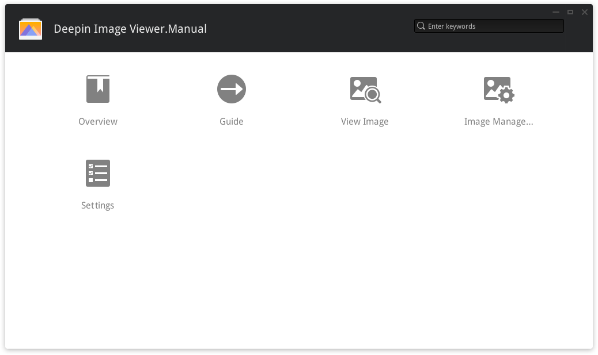

### About

In ** Settings**, select ** About** to check the version and introduction of Deepin Image Viewer.

### Exit

In ** Settings**, select ** Exit** to exit Deepin Image Viewer.
