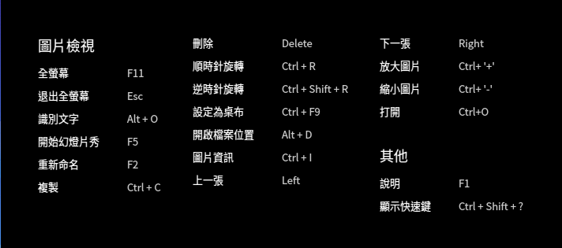
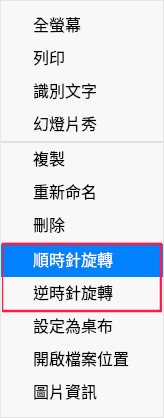
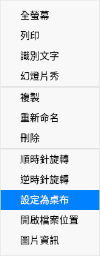

# 圖片檢視器|deepin-image-viewer|

## 概述

圖片檢視器是一款小巧的圖片查看應用軟體。外觀時尚、性能流暢，支援多種圖片格式，隨時想看就看，實用又快捷。

## 使用入門

透過以下方式執行或關閉圖片檢視器，或者建立圖片檢視器的捷徑。

### 執行圖片檢視器

1. 單擊桌面底部的  ，進入啟動器介面。
2. 上下滾動滑鼠滾輪瀏覽或透過搜尋，找到圖片檢視器 單擊執行。
3. 右鍵單擊 ，您可以：
 - 單擊 **建立桌面捷徑**，在桌面建立捷徑。
 - 單擊 **釘選到Dock**，將應用程式固定到Dock。
 - 單擊 **開機啟動**，將應用程式添加到開機啟動項，在電腦開機時自動執行該應用。

### 關閉圖片檢視器

- 在圖片檢視器介面單擊  ，關閉圖片檢視器。
- 在任務欄右鍵單擊 ，選擇 **全部關閉** 來關閉圖片檢視器。
- 在圖片檢視器介面單擊 ，選擇 **離開** 來關閉圖片檢視器。

### 查看快捷鍵

在圖片檢視器介面上，按下鍵盤上的按下鍵盤上的 **Ctrl + Shift + ?** 組合鍵來查看快捷鍵。

## 圖片檢視

### 開啟圖片
採用以下任一方式開啟圖片。
- 右擊圖片，選擇用圖片檢視工具開啟圖片。
- 設定圖片檢視器為預設的圖片查看程式後，雙擊圖片開啟。
- 執行圖片檢視器後，單擊 **開啟圖片**，選擇文件開啟。
- 執行圖片檢視器後，拖動圖片到圖片檢視器介面，開啟圖片。
- 直接拖動圖片到圖片檢視器在桌面或任務欄的圖示，開啟圖片。

> 竅門：您可以在控制中心中將圖片檢視器設定為預設的圖片檢視程式，具體操作請參閱 [預設程式設定](dman:///dde#預設程式設定)。

圖片檢視器支援查看BMP、ICO、JPG/JPE/JPEG、PNG、TGA、TIF/TIFF、XPM、GIF、WEBP、CR2、NEF、DNG、RAF、MEF、MRW、XBM、SVG、ORF、MNG等多種格式的圖片。

>  說明：當使用觸控螢幕電腦時，在觸摸屏上二指張開，放大圖片；二指捏合，縮小圖片。

### 介面介紹

| 圖示                                                   | 名稱       | 說明                   |
| ------------------------------------------------------ | ---------- | ---------------------- |
|                     | 上一張     | 顯示上一張圖片。       |
|                             | 下一張     | 顯示下一張圖片。       |
|                | 1:1檢視    | 圖片按照實際尺寸顯示。 |
|              | 適應視窗   | 圖片適應視窗尺寸顯示。 |
|  | 順時針旋轉 | 圖片順時針旋轉90度。   |
|             | 逆時針旋轉 | 圖片逆時針旋轉90度。   |
|                         | 刪除       | 刪除目前圖片。         |

> 說明：如果開啟的是系統圖片，旋轉功能、刪除圖示處於置灰狀態，即不能使用該操作。

### 顯示/隱藏導航視窗

1. 在看圖介面上，單擊工具列上的  按鈕或滾動滑鼠放大圖片且當圖片超出介面範圍時，介面上會出現導航視窗。

2. 拖動導航視窗內的方框，查看該區域的訊息。

3. 單擊導航視窗上的 **x** 按鈕或在右鍵選單中選擇 **隱藏導航視窗** 來關閉導航視窗。

   關閉導航視窗後下次不會再顯示，需在右鍵選單中選擇 **顯示導航視窗** 來開啟。

### 列印圖片

1. 在看圖介面上，單擊滑鼠右鍵。
2. 選擇 **列印**。
3. 選擇一個印表機。
4. 根據需要設定列印屬性。
5. 選擇 **列印**，將圖片發送到印表機進行列印。

### 重新命名

1. 在圖片檢視器介面上，單擊滑鼠右鍵。
2. 選擇 **重新命名**，在彈出的重新命名視窗內，將圖片名字進行修改。
3. 單擊 **確定** 完成修改。
>說明：系統圖片不支援重新命名。

### 幻燈片秀

1. 在圖片檢視器介面上，單擊滑鼠右鍵。
2. 選擇 **幻燈片秀**，圖片將以幻燈片形式全螢幕播放。
4. 按下鍵盤上**Esc** 鍵退出播放。

### 複製圖片

1. 在圖片檢視器介面上，單擊滑鼠右鍵。
2. 選擇 **複製**。
3. 在桌面或者指定位置，單擊滑鼠右鍵。
4. 選擇 **貼上**，將圖片文件複製到該位置。

### 旋轉圖片

1. 在圖片檢視器介面上，單擊滑鼠右鍵。
2. 選擇 **順時針旋轉/逆時針旋轉**。
3. 圖片將會順時針轉旋轉90°/逆時針旋轉90°。

> 說明：當使用觸控螢幕電腦時，二指放置在圖片上並保持一定距離，同時旋轉二指來旋轉圖片。

### 設定為桌布

1. 在圖片檢視器介面上，單擊滑鼠右鍵。
2. 選擇 **設定為桌布** 即可將目前圖片設定為桌布。

### 開啟檔案位置
1. 在圖片檢視器介面上，單擊滑鼠右鍵。
2. 選擇 **開啟檔案位置**，定位該圖片的存儲位置。

### 查看圖片資訊

1. 在圖片檢視器介面上，單擊滑鼠右鍵。
2. 選擇 **圖片資訊** ，查看圖片詳細資訊。

### 刪除圖片

透過以下任一方式刪除圖片：

- 單擊圖片檢視器介面上的  圖示。
- 右鍵單擊圖片，選擇 **刪除**。
- 在圖片檢視器介面上，按下鍵盤的 **Delete** 鍵。

## 主選單

在主選單中，您可以切換視窗主題、查看說明手冊，了解圖片檢視器的更多訊息。

### 主題

視窗主題包含亮色主題、暗色主題和系統主題。

1. 在圖片檢視器介面，單擊  。
2. 單擊 **主題**，選擇一個主題顏色。

### 說明

查看說明手冊，進一步了解和使用圖片檢視器。

1. 在圖片檢視器介面，單擊  。
2. 單擊 **說明**。
3. 查看圖片檢視器的說明手冊。

### 關於

1. 在圖片檢視器介面，單擊  。
2. 單擊 **關於**。
3. 查看圖片檢視器的版本和介紹。

### 離開

1. 在圖片檢視器介面，單擊 。
2. 單擊 **離開**。   
